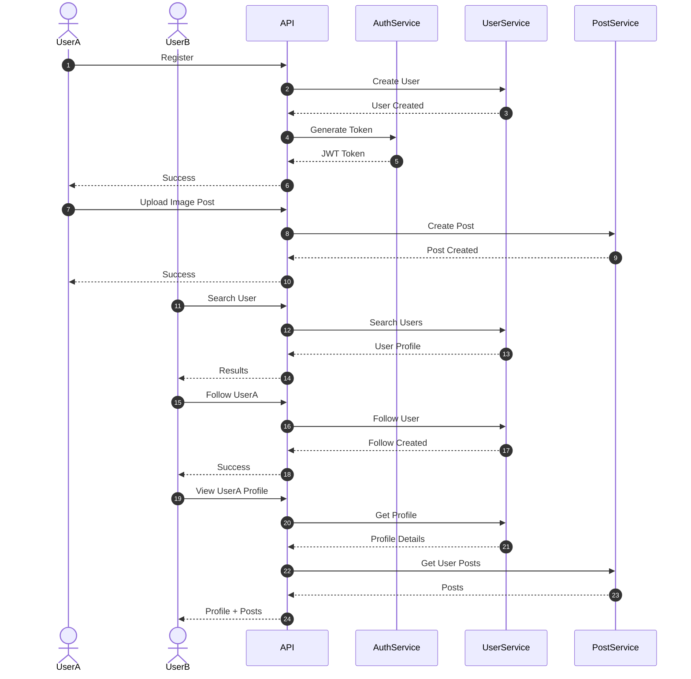

# Design a Highly Scalable Image Sharing Social Media Platform

## Gathering Functional Requirements

- What kind of information do we need to store about each registered user?
- What type of media can the user share?
  - Only images? Text? Video? Etc.
- What type of relationship do we have between users?
- What kind of operations can a user perform on the platform?

### In Scope

- When a user registers, they provide:
  - Mandatory: first name, last name, email address, password, profile image
  - Optional: age, location, interests, etc.
- Users can share only images.
- Every user can follow any user they want.

### Functional User Actions

#### In Scope

- A user can:
  - Post a new image
  - Follow or unfollow a user
  - Search for other users
  - View other users' public info and shared images
  - See a timeline feed posted by the people they follow

#### Out of Scope

- Reactions
- Comments
- Sharing
- Etc.

## Gather Non-Functional Requirements

### Scalability

- Billions of active users, like Facebook
- Most likely hundreds of millions of visits per day
- Each user uploads 1 image per day (2 MB)
- Data processing volume: 1 PB/day

### Availability

- 99.99% uptime

### Performance

- Since end users interact with the system directly, we need to reduce response time and page load time for every interaction on the platform.
- Target around 500 ms end-to-end latency at the 99th percentile.

## Sequence Flow

## System Context

## Container Diagram

## High Level Design

## Architectural Reasoning

### Why Containers over Lambda

* **Lower latency**  Lambda cold starts can add extra latency, which may affect the 500ms P99 response time target. Containers remain warm and are better suited for latency-sensitive APIs.
* **Fewer execution constraints**  Lambda has runtime and resource limits, while containers provide more flexibility for long-running workloads such as feed generation, media processing coordination, and background workers.
* **Cost efficiency at scale** At hundreds of millions of requests per day, always-running containers can be more cost-efficient than paying per Lambda invocation.
* **Sustained traffic**  The platform has constant and predictable high traffic, which is better suited for continuously running services rather than purely event-driven compute.

### Why EKS

* **Efficient resource usage**  Kubernetes schedules multiple services on the same node when resources are available, helping maximize CPU and memory utilization while reducing wasted compute.
* **Independent scaling**  Each service, such as auth, feed, search, and user, can scale independently based on its own traffic pattern using Horizontal Pod Autoscaling and cluster autoscaling.
* **Self-healing and orchestration**  Kubernetes provides health checks, rolling deployments, automatic pod restarts, service discovery, and workload orchestration out of the box.

### Why DynamoDB over SQL

* **Access-pattern driven design**  User profiles, posts, timelines, and follow relationships can be modeled using partition keys and indexes without requiring expensive joins.
* **Read-heavy performance**  The platform is  read-heavy (feeds, profiles, images). DynamoDB delivers consistent single-digit millisecond latency because requests are routed directly to the target partition using the partition key. Queries do not require joins or scans, so performance remains predictable even as the dataset grows to billions of records.
* **Connection database**  Unlike traditional SQL databases, DynamoDB uses http-based requests and does not rely on connection pools, eliminating connection exhaustion concerns under extreme concurrency.
* **Horizontal scaling**  DynamoDB automatically distributes data across partitions and scales throughput without requiring application-managed sharding.
* **Reduced operational overhead**  No replica management, failover configuration, vacuuming, or index maintenance. DynamoDB handles these concerns as a managed service.

##### SQL indexes remain very fast even with billions of rows. The bigger challenges at massive scale are joins, sorting, aggregations, connection limits, and horizontal sharding. DynamoDB avoids many of those costs by designing data around known access patterns and direct partition-key lookups.

